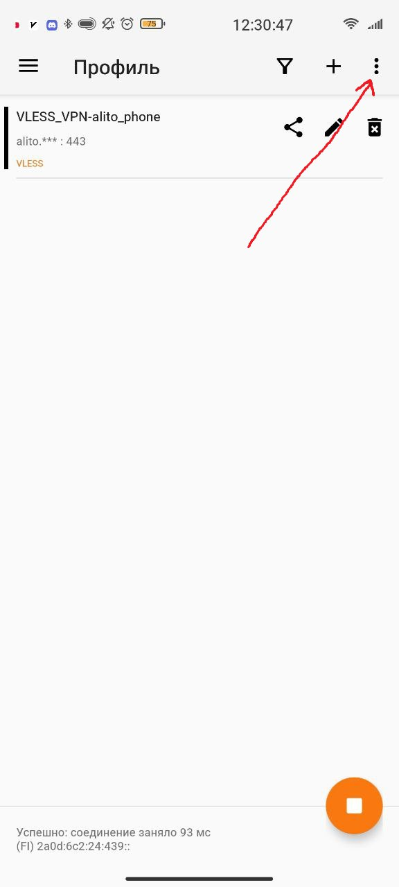
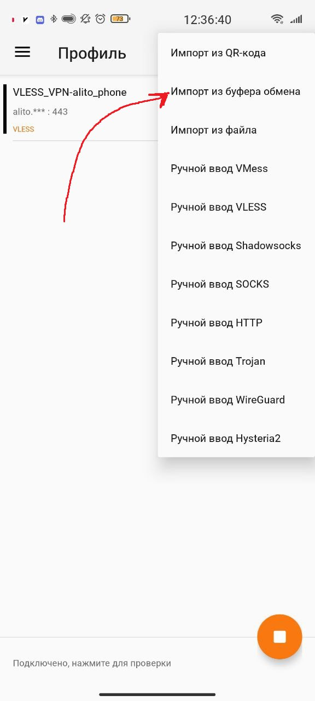
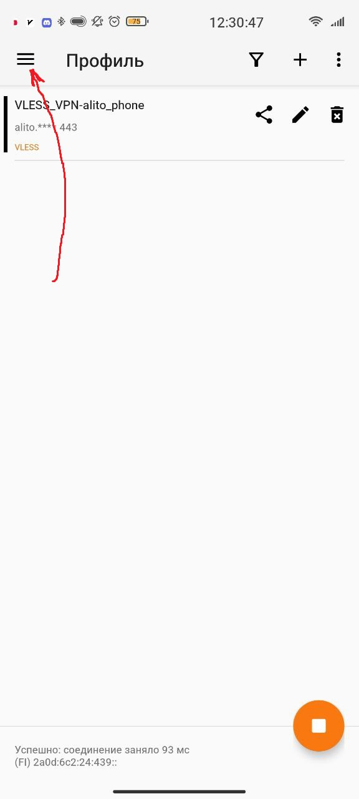
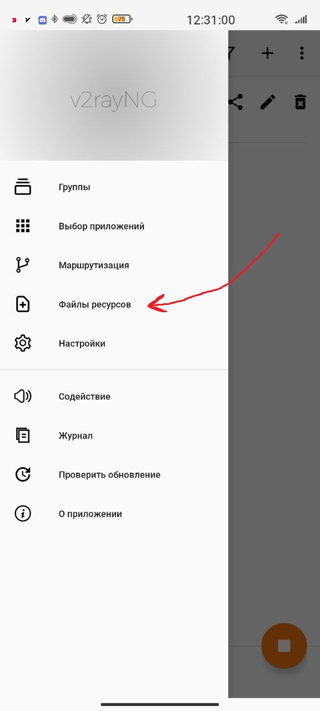
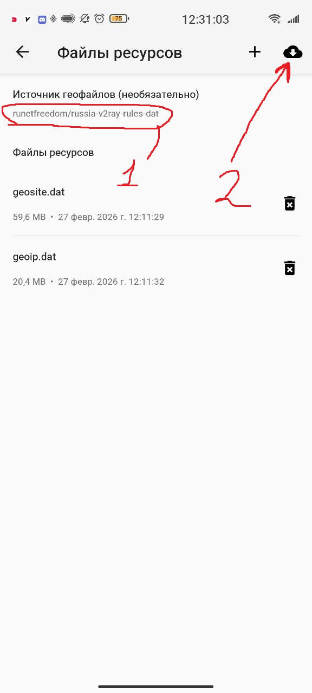
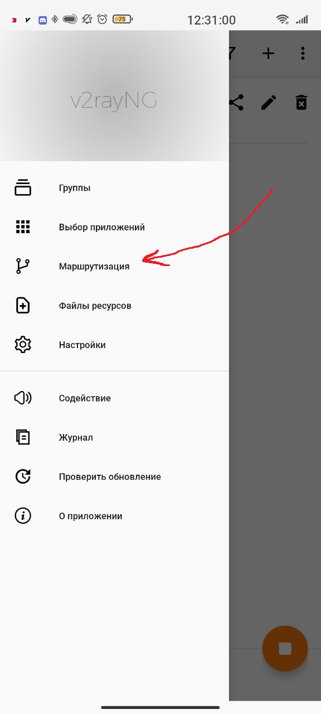
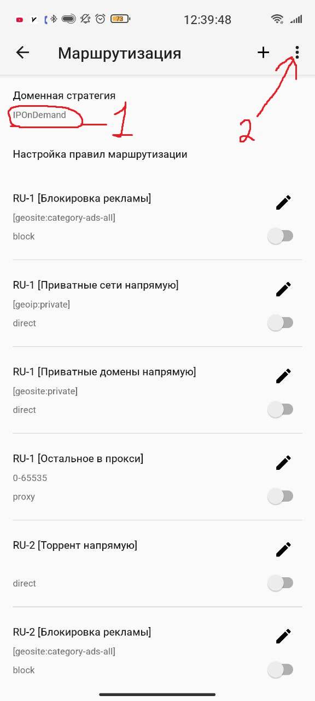
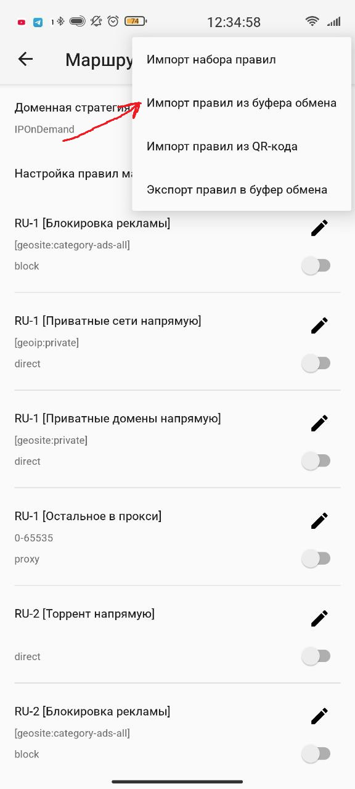

<h1>V2rayNG-GUIDE</h1>

Инструкция по настройке приложения на телефоне.

<h2>V2rayNG</h2>

  <!-- Карточка 1 -->
  

    
    
Нажимаем на 3 точки на главном экране как на картинке. Предварительно надо скопировать текст своей конфигурации

  

  <!-- Карточка 2 -->
  

    
    
Импортируем из буфера обмена

  

  <!-- Карточка 3 -->
  

    
    
Жмем на 3 полоски слева сверху

  

  <!-- Карточка 4 -->
  

    
    
Файлы ресурсов

  

  <!-- Карточка 5 -->
  

    
    
Сначала источник выбираем как на картинке, потом жмем на облако для обновления файлов

  

  <!-- Карточка 6 -->
  

    
    
Возвращаемся в меню и жмем маршрутизация. Копируем текст :

	<pre style="background: #2d2d2d; color: #f8f8f2; padding: 12px; border-radius: 6px; overflow-x: auto; font-size: 14px;"><code>
[{"domain":["geosite:category-ads-all"],"enabled":false,"looked":false,"outboundTag":"block","remarks":"RU-1 [Блокировка рекламы]"},{"enabled":false,"ip":["geoip:private"],"looked":false,"outboundTag":"direct","remarks":"RU-1 [Приватные сети напрямую]"},{"domain":["geosite:private"],"enabled":false,"looked":false,"outboundTag":"direct","remarks":"RU-1 [Приватные домены напрямую]"},{"enabled":false,"looked":false,"outboundTag":"proxy","port":"0-65535","remarks":"RU-1 [Остальное в прокси]"},{"enabled":false,"looked":false,"outboundTag":"direct","protocol":["bittorrent"],"remarks":"RU-2 [Торрент напрямую]"},{"domain":["geosite:category-ads-all"],"enabled":false,"looked":false,"outboundTag":"block","remarks":"RU-2 [Блокировка рекламы]"},{"enabled":false,"ip":["geoip:private"],"looked":false,"outboundTag":"direct","remarks":"RU-2 [Приватные сети напрямую]"},{"domain":["geosite:private"],"enabled":false,"looked":false,"outboundTag":"direct","remarks":"RU-2 [Приватные домены напрямую]"},{"enabled":false,"ip":["geoip:ru"],"looked":false,"outboundTag":"direct","remarks":"RU-2 [Доступные только в России напрямую]"},{"enabled":false,"looked":false,"outboundTag":"proxy","port":"0-65535","remarks":"RU-2 [Остальное в прокси]"},{"enabled":false,"looked":false,"outboundTag":"direct","protocol":["bittorrent"],"remarks":"RU-3 [Торрент напрямую]"},{"domain":["geosite:category-ads-all"],"enabled":false,"looked":false,"outboundTag":"block","remarks":"RU-3 [Блокировка рекламы]"},{"enabled":false,"ip":["geoip:private"],"looked":false,"outboundTag":"direct","remarks":"RU-3 [Приватные сети напрямую]"},{"domain":["geosite:private"],"enabled":false,"looked":false,"outboundTag":"direct","remarks":"RU-3 [Приватные домены напрямую]"},{"enabled":false,"ip":["1.0.0.1","1.1.1.1","8.8.8.8","8.8.4.4"],"looked":false,"outboundTag":"proxy","remarks":"RU-3 [DNS в прокси]"},{"enabled":false,"looked":false,"network":"udp","outboundTag":"proxy","port":"50000-65535","remarks":"RU-3 [Дискорд (Голосовой) в прокси]"},{"enabled":false,"ip":["geoip:ru-blocked"],"looked":false,"outboundTag":"proxy","remarks":"RU-3 [Заблокированные сети в прокси]"},{"domain":["geosite:ru-blocked"],"enabled":false,"looked":false,"outboundTag":"proxy","remarks":"RU-3 [Заблокированные домены в прокси]"},{"enabled":false,"looked":false,"outboundTag":"direct","port":"0-65535","remarks":"RU-3 [Остальное напрямую]"}]
</code></pre>
  

  <!-- Карточка 7 -->
  

    
    
Сначала стратегию выбираем как на картинке, затем жмем на 3 точки

  

  <!-- Карточка 8 -->
  

    
    
Импортируем. Выбрием все поля с RU-3

  

